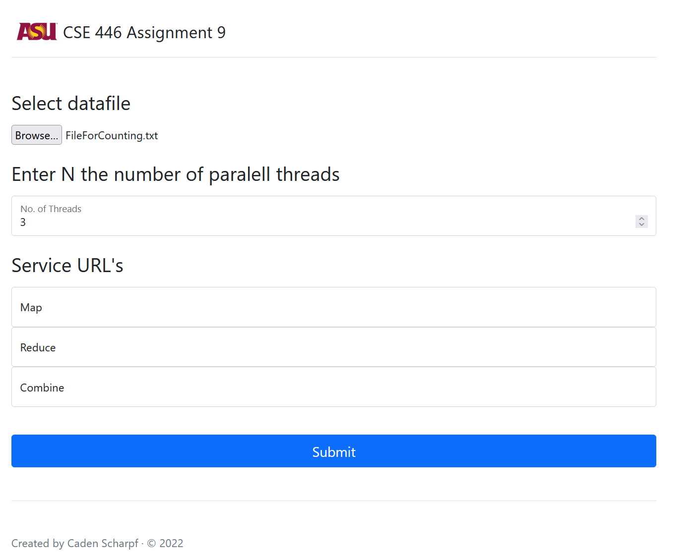

# Service Oriented MapReduce

</img> 

    
    This program is designed to efficiently process large sets of text using the MapReduce paradigm. The map, reduce, and combine functions are implemented as multi-threaded WCF SOAP services.

## Table of Contents
- [Overview](#overview)
- [Installation](#installation)
- [Usage](#usage)
- [Input](#input)
- [Output](#output)
- [License](#license)

## Overview

    The Service Oriented MapReduce program provides a solution for processing large sets of text using the MapReduce paradigm. It utilizes multi-threaded WCF SOAP services to implement the map, reduce, and combine functions. This approach enables efficient and parallel processing of text data, resulting in faster analysis and insights.

## Installation

    
    To use the Service Oriented MapReduce program, follow these steps:

    1. Clone or download this repository to your local machine.
    2. Set up the necessary dependencies, including the .NET Framework 4.5 or above and the Windows Communication Foundation (WCF) runtime.
    3. Configure and host the SOAP services for map, reduce, and combine functions using a suitable hosting environment such as Internet Information Services or Windows Service.
    

## Usage

        
    1. Prepare your text file that needs to be processed.
    2. Determine the number of threads you want to utilize for the MapReduce process.
    3. Obtain the service URLs for the MAP, REDUCE, and COMBINE services.
    4. Launch the program and provide the necessary input parameters.
    5. Monitor the progress of the MapReduce process as it distributes the workload across the available threads and services.
    6. Once the process completes, the program returns a dictionary mapping each word in the data file to its respective word count.

## Input

    
    The Service Oriented MapReduce program requires the following inputs:

    - Text file: The large text dataset that needs to be processed.
    - Number of threads: The desired number of threads for parallel processing.
    - Service URLs: The URLs for the MAP, REDUCE, and COMBINE services, which implement the corresponding functions.
    

## Output

    
    Upon completion of the MapReduce process, the program generates an output dictionary. This dictionary maps each word in the input text file to its respective word count. The output provides valuable insights into the frequency of each word in the dataset.    

## License

    
    This program is licensed under the MIT License. See the [LICENSE](LICENSE) file for more information.
    

